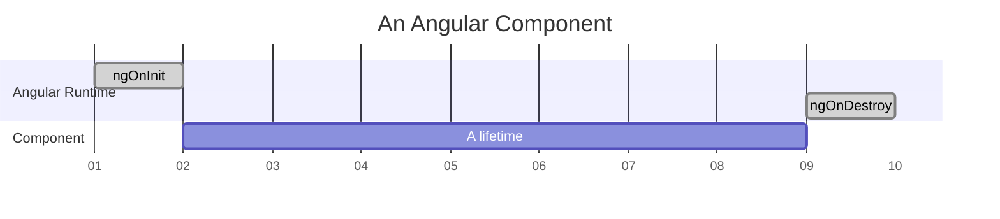

# ng-cycler

is a tiny helper for binding things to Angular component's lifetime (a period between `ngOnInit` and `ngOnDestroy`);



## Why?

When you develop Angular components you can often find yourself doing one thing over and over again -- connecting dependencies to component's lifetime. Usually it looks like this:

```typescript
export class MyComponent implements OnInit, OnDestroy {
    // <3>
    private _mySubscription: Subscription = Subscription.EMPTY;

    ngOnInit() {
        // <1>
        this._mySubscription = this._myEventBus.subscribe(/* ... */);
    }

    ngOnDestroy() {
        // <2>
        this._mySubscription.unsubscribe();
    }
}
```

1. you create something in `ngOnInit`;
2. you dispose it in `ngOnDestroy`;
3. you need a field to store some ref in the class;

This code looks cumbersome once you repeat it many times for various dependencies.

The objective of ng-cycler is to manage the dependency lifetime from one place by a single line of code:

```typescript
export class MyComponent implements OnInit, OnDestroy {
    ngOnInit() {
        this._cycler.manage(
            // this subscription will be unsubscribed
            // automatically on onNgDestroy
            this._myEventBus.subscribe(/* ... */)
            
            // Actually the `manage` method can accept a subscription,
            // a callback or a `Disposable` object. Depending on the
            // thing you pass the following will happen on `onNgDestroy`:
            //   - subscription will be unsubscribed
            //   - callback will be just called
            //   - `dispose` method will be called for Disposable instance
        );
    }
}
```

## How?

Getting Started:

1. Install the package to your Angular project

```
npm install ng-cycler
```

2. Get you Component aware of the Cycler, there are two options for that.

### Option 1 (recommended for small projects, playgrounds etc.)

Make your Component extend the [Cycler](src/cycler.ts) class:

```typescript
import { Cycler } from 'ng-cycler';


export class MyComponent extends Cycler implements OnInit {
    ngOnInit() {
        this.manage(
            // You can use `manage` and other
            // Cycler methods starting with "this."
            
            /* ... */
        );
    }
}
```

### Option 2 (if you do not want to pollute your Component hierarchy)

Provide a Cycler instance by Angular DI:

```typescript
import { Cycler } from 'ng-cycler';

@Component({
    //...
    providers: [Cycler]
    //...
})
export class MyComponent implements OnInit {
    constructor(
        private readonly _cycler: Cycler) {
    }
    
    ngOnInit() {
        this._cycler.manage(
            // You can use `manage` and other
            // Cycler methods starting with "this._cycler"
            
            /* ... */
        );
    }
}
```

3. Start using `Cycler` by calling `this.manage` or `this._cycler.manager` depending on the option you chose in the previous step.
