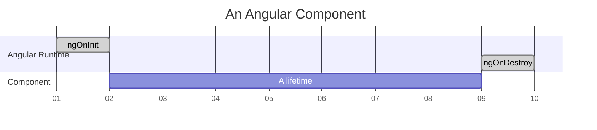
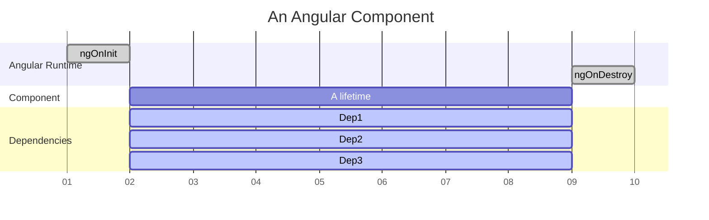
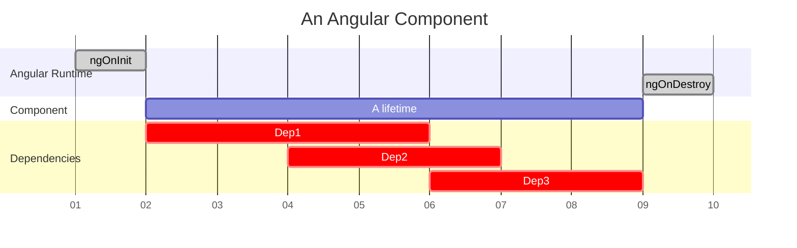
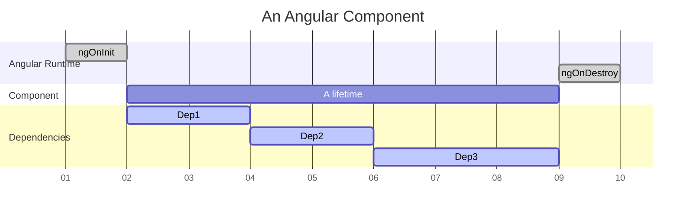

# ng-cycler


Ng-Cycler is a tiny helper for releasing resources that are bound to Angular component's lifetime (a period between `ngOnInit` and `ngOnDestroy`).



## Why?

It's important for Angular Components developer to make sure every resource (open connection, event bus subscription, http request) is finalized during the Component destroy phase. 

> **Warning** 
> In other words: whenever you subscribe to anything you need to unsubscribe in the end, do not rely on Angular. Even HTTP-Client cold observables should be unsubscribed.

Because of that you can often find yourself doing one thing over and over again — manually connecting dependencies to component's lifetime. Usually it looks like this:

```typescript
export class MyComponent implements OnInit, OnDestroy {
    // <3>
    private _mySubscription: Subscription = Subscription.EMPTY;

    ngOnInit() {
        // <1>
        this._mySubscription = this._myEventBus.subscribe(/* ... */);
    }

    ngOnDestroy() {
        // <2>
        this._mySubscription.unsubscribe();
    }
}
```

1. you create something in `ngOnInit`;
2. you dispose it in `ngOnDestroy`;
3. you need a field to store some ref in the class;

This code might look cumbersome once you copy/paste it many times for various dependencies.

The objective of **ng-cycler** is to manage the dependency lifetime in just one place by a single line of code:

```typescript
export class MyComponent implements OnInit, OnDestroy {
    ngOnInit() {
        this._cycler.manage(
            // this subscription will be unsubscribed
            // automatically on onNgDestroy
            this._myEventBus.subscribe(/* ... */)
            
            // Actually the `manage` method can accept a subscription,
            // a callback or a `Disposable` object. Depending on the
            // thing you pass the following will happen on `onNgDestroy`:
            //   - subscription will be unsubscribed
            //   - callback will be just called
            //   - `dispose` method will be called for Disposable instance
        );
    }
}
```

## How?

Getting Started:

1. Install the package to your Angular project

```
npm install ng-cycler
```

2. Get you Component aware of the Cycler, there are two options for that.

### Option 1 (recommended for small projects, playgrounds etc.)

Make your Component extend the [Cycler](src/cycler.ts) class:

```typescript
import { Cycler } from 'ng-cycler';


export class MyComponent extends Cycler implements OnInit {
    ngOnInit() {
        this.manage(
            // You can use `manage` and other
            // Cycler methods starting with "this."
            
            /* ... */
        );
    }
}
```

### Option 2 (if you do not want to pollute your Component hierarchy)

Provide a Cycler instance by Angular DI:

```typescript
import { Cycler } from 'ng-cycler';

@Component({
    //...
    providers: [Cycler]
    //...
})
export class MyComponent implements OnInit {
    constructor(
        private readonly _cycler: Cycler) {
    }
    
    ngOnInit() {
        this._cycler.manage(
            // You can use `manage` and other
            // Cycler methods starting with "this._cycler"
            
            /* ... */
        );
    }
}
```

3. Start using `Cycler` by calling `this.manage` or `this._cycler.manager` depending on the option you chose in the previous step.

## API and Use-Cases

### 1. `manage` method

Use `manage` method to bind a Dependency to the entire component's lifetime, starting from `ngOnInit` up to `ngOnDestroy`.



The Dependency could be a Subscription, a callback or a [Disposable](src/disposable.interface.ts) object:

```typescript
import { Subscription } from 'rxjs';
import { Cycler } from 'ng-cycler';

export class MyComponent implements OnInit {
    ngOnInit() {
        const sub: Subscription = this._myEventBus.subscribe(/* ... */);
        
        // The `sub` Subscription will be unsubscribed on destroy.
        this._cycler.manage(sub);

        this._cycler.manage(() => {
            // This is a Callback, it will be
            // invoked on Component destroy.
        });
        
        this._cycler.manage({
            // This is a Disposable object
            dispose() {
                // `dispose` method will be called on destroy.
            }
        });
    }
}
```

`manage` method returns a [Disposable](src/disposable.interface.ts) object that can be used to force destruction manually if it's needed for whatever reason.

```typescript
import { Subscription } from 'rxjs';
import { Cycler } from 'ng-cycler';

export class MyComponent implements OnInit {
    ngOnInit() {
        const sub: Subscription = this._myEventBus.subscribe(/* ... */);
        
        // The `sub` Subscription will be unsubscribed on destroy.
        const dependency = this._cycler.manage(sub);
        
        // Calling `dispose` causes dependency destroy right away.
        // In case of subscription it forces `unsubscribe`.
        dependency.dispose();
    }
}
```

### 2. `manageAll` method

`manageAll` is a shortcut to call `manage` for multiple dependencies:

```typescript
import { Subscription } from 'rxjs';
import { Cycler } from 'ng-cycler';

export class MyComponent implements OnInit {
    ngOnInit() {
        // We pass multiple Subscriptions to manageAll
        // all of them will be unsubcsribed on Component destroy
        const dependency = this._cycler.manageAll(
            // Subscription 1
            this._myEventBus.subscribe(/* ... */),
            
            // Subscription 2
            this._myService1.subscribe(/* ... */),
            
            // Subscription 3
            this._myService2.subscribe(/* ... */));
    }
}
```

### 3. `manageTransient` method

Use `manageTransient` if you have a repeated action producing Dependencies and you need to make sure the previous Dependency has been finalized before the next one starts. In other words you want to prevent Dependencies lifetime overlapping like this:



and turn it into this:



In rxjs-world you would typically overcome this using methods like `switchMap`.

First argument of `manageTransient` method is the unique string code to be used as Dependency type descriptor. Once `manageTransient` is called with the same `code` the previous Dependency will be finalized. In case of no additional calls the Dependency will be finalized `OnDestroy` just like for `manage` method.  

```typescript
import { Subscription } from 'rxjs';
import { Cycler } from 'ng-cycler';

export class MyComponent implements OnInit {
    search(query: string) {
        this._cycler.manageTransient(
            // Another transient dependency (if there is any) with
            // code 'search' will be finalized right away.
            'search',
            
            this._myService.search(query).subscribe(/* ... */));
    }
}
```
